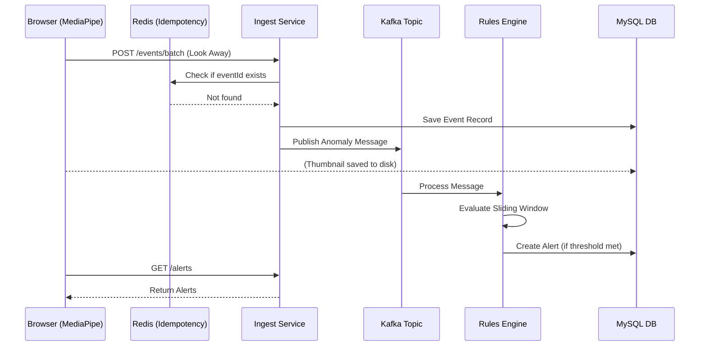

# AI Exam Proctoring: End-to-End System Flow

This document explains how the proctoring system works, from the moment you turn on your camera to the moment an alert is generated on the server.

---

## 🚀 Technical Overview & Endpoints

| Activity | Endpoint | Method | Role |
| :--- | :--- | :--- | :--- |
| **Auth** | `/proctoring/dev/token` | `POST` | Generates a 1-hour JWT for local testing. |
| **Sessions** | `/proctoring/sessions/start` | `POST` | Initializes a session, returns `sessionId`. |
| **Events** | `/proctoring/events/batch` | `POST` | Receives batches of anomalies + thumbnails. |
| **Alerts** | `/proctoring/sessions/{id}/alerts` | `GET` | Client polls this to show server-side alerts. |

---

## 1. The Watchful Eye (Frontend - Your Browser)
The process starts right in your web browser. Unlike traditional systems that send your entire video feed to a server, this system is "smart" and does the heavy lifting on your own computer.

*   **MediaPipe AI**: The app uses Google's MediaPipe to track your face markers and head pose.
*   **In-Memory Queue**: Detections aren't sent immediately. They are stored in an **In-Memory Queue** (`pendingEvents` in React).
*   **Retry Mechanism**: Every 5 seconds, the system tries to send the batch. If the network is down, events stay in memory and the "Event Queue" counter increases. Once back online, the system sends all accumulated events.
*   **Duplicate Prevention**: Each event has a unique `eventId`. The server tracks these to ensure a re-sent batch doesn't cause double alerts.
*   **Evidence Collection**: Serious events trigger a low-res JPEG capture (saved in memory as Base64 until sent).

---

## 2. The Gateway (Backend - Event Ingest Service)
When the browser sends a batch, it's processed by the **Event Ingest Service**.

*   **Idempotency (Redis)**: The service checks Redis to see if an `eventId` was already processed. If so, it's ignored.
*   **Storage (MySQL & Disk)**: 
    *   Event data (type, timestamp, confidence) is saved to the `proctoring_anomaly_events` table.
    *   Thumbnails are decoded and saved to `/tmp/proctoring/thumbnails` on the server.
*   **Kafka Dispatch**: The service publishes a message to the Kafka topic `proctoring.anomaly.events` for asynchronous processing.

---

## 3. The Brain (Kafka & Rules Engine)
This is where the complex patterns are detected.

*   **Kafka Pipeline**: By using Kafka, the system can handle thousands of students simultaneously without slowing down the ingestion service.
*   **Sliding Windows**: The **Rules Engine** listens to the Kafka topic. It maintains a "Sliding Window" in memory for each user.
    *   Example: "Did this user look away 5 times in the last 60 seconds?"
*   **Risk Scoring**: Every detected anomaly adds to a session's `currentRiskScore` in the database.

---

## 4. The Result (Dashboard)
Finally, all this data is shown to the exam administrators.

*   **Polling Alert System**: The frontend polls the server every 10 seconds to fetch new alerts generated by the Rules Engine.
*   **Proctor UI**: Alerts appear as red flags with severity levels (LOW, MEDIUM, HIGH, CRITICAL).

---

## 📝 Example: The Life of a "Look Away" Anomaly

1.  **Detection (t=0s)**: Student *John* turns his head >30 degrees to look at a phone.
2.  **frontend Buffering (t=5s)**: MediaPipe tracks this for 5 seconds. A `LOOK_AWAY` event is created and added to the local queue.
3.  **transmission (t=10s)**: The next batch cycle kicks in. The event is sent to the backend.
4.  **Ingestion (t=10.1s)**: The backend saves it to MySQL and sends it to the **Kafka** queue.
5.  **Rules Engine (t=10.5s)**: The Rules Engine sees the event. It notices John has looked away **3 times** in the last minute. 
6.  **Alert Generation**: The Engine creates a `MEDIUM` severity alert in the `proctoring_alerts` table.
7.  **Dashboard Display (t=20s)**: John's browser polls for alerts. A warning message "Please stay focused on the screen" appears on his dashboard.

---

### End-to-End Flow Diagram

